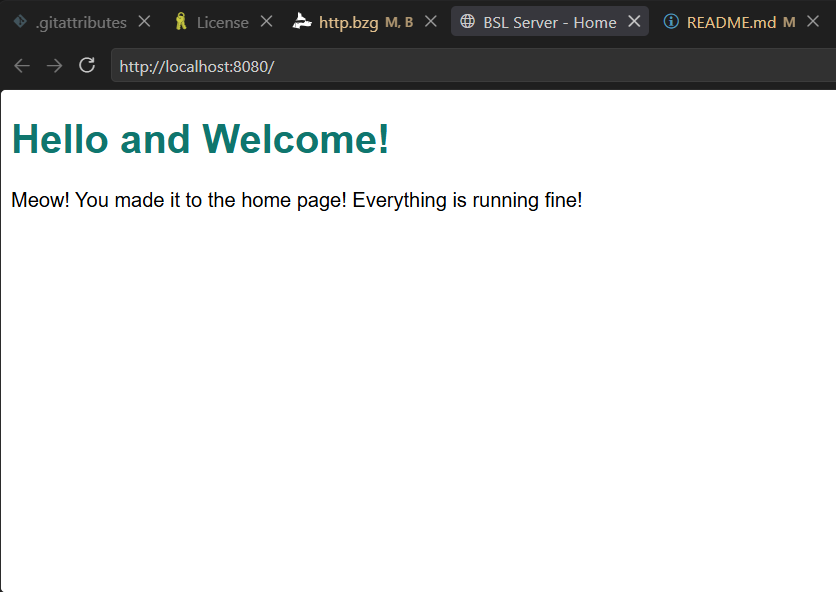
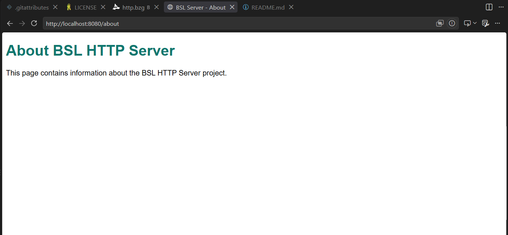
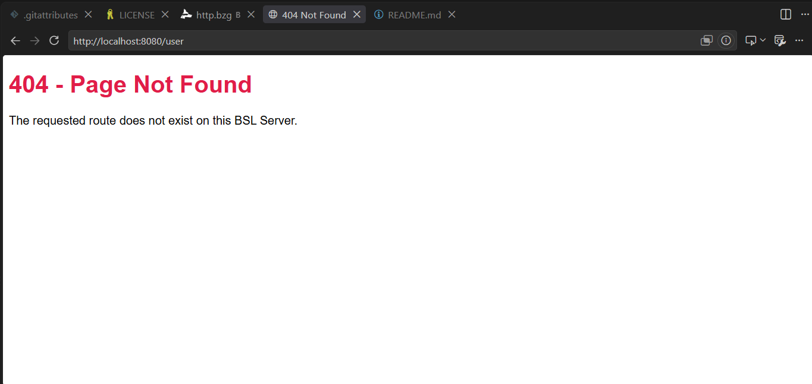
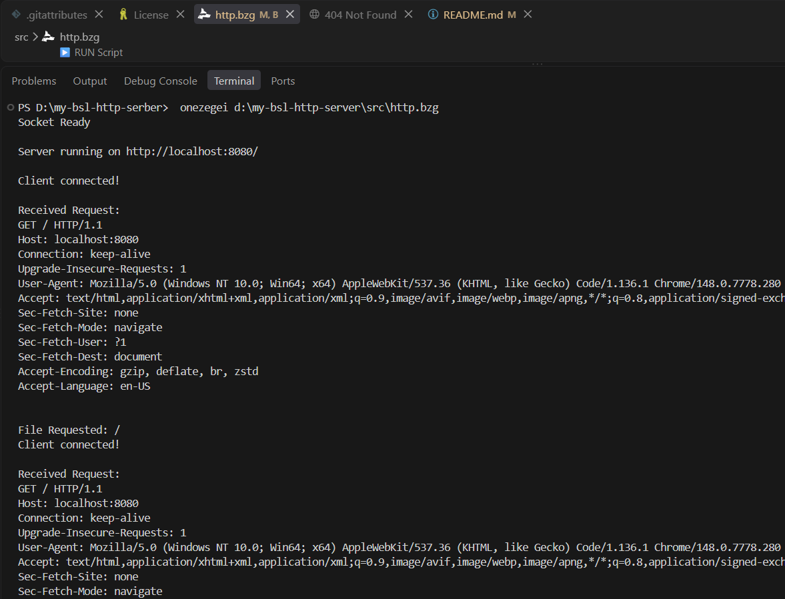

# my-bsl-http-server
 
## Project Description
 
This is a small HTTP server built using the Bonezegei Scripting Language (BSL) and its socket library, as part of Lab 1: Building an HTTP Server using Socket. Instead of using a ready-made web framework, the server handles everything manually such as opening a socket, binding it to a port, listening for connections, reading the raw HTTP request, and writing back the response itself.
 
It runs on port 8080 and has three routes:
- / route — the homepage
- / about route — an about page
- / anything else/unmmaped route — a 404 page
## Installation & Setup Guide
 
1. Install the Bonezegei Scripting Language interpreter. In VS Code, go to Extensions, search "Bonezegei," and install the Bonezegei Scripting Language Formatter. It has instructions for installing the interpreter for your OS. (Windows/Linux: follow the guide directly. Mac/Android: use GitHub Codespaces with the Linux instructions.)
2. Clone this repo and open it in VS Code:
```bash
   git clone https://github.com/divineongue-sys/my-bsl-http-server.git
   cd my-bsl-http-server
```
3. Install the socket library:
```bash
   bzg install socket
```
4. Run the server:
```bash
   bonezegei src/http.bzg
```
   If it worked, you'll see "Socket Ready" and "Server running on http://localhost:8080/" printed in the terminal.
 
## Usage Instructions
 
With the server running, open a browser and try these:
 
- `http://localhost:8080/` — shows the homepage
- `http://localhost:8080/about` — shows the about page
- `http://localhost:8080/anything` — shows a 404 page, since that route doesn't exist

You can also watch the terminal while you do this, it prints out each request as it comes in.
 
## Screenshots
 
Screenshots are in the `documentation` folder.
 
**/ route**

 
**/ about route**

 
**Unknown route (404 page)**

 
**Terminal running the server**
